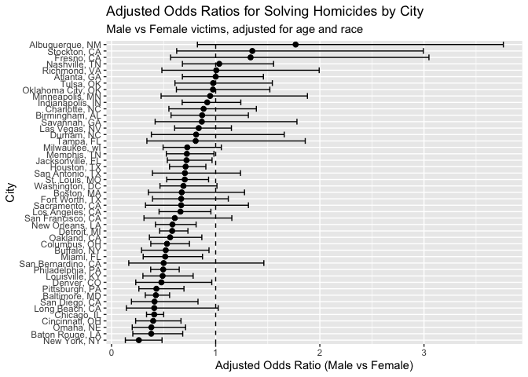

hw6_vy2196
================

``` r
library(tidyverse)
```

    ## ── Attaching core tidyverse packages ──────────────────────── tidyverse 2.0.0 ──
    ## ✔ dplyr     1.1.4     ✔ readr     2.1.5
    ## ✔ forcats   1.0.1     ✔ stringr   1.5.1
    ## ✔ ggplot2   4.0.0     ✔ tibble    3.3.0
    ## ✔ lubridate 1.9.4     ✔ tidyr     1.3.1
    ## ✔ purrr     1.1.0     
    ## ── Conflicts ────────────────────────────────────────── tidyverse_conflicts() ──
    ## ✖ dplyr::filter() masks stats::filter()
    ## ✖ dplyr::lag()    masks stats::lag()
    ## ℹ Use the conflicted package (<http://conflicted.r-lib.org/>) to force all conflicts to become errors

``` r
library(broom)
library(purrr)
library(forcats)
```

### Problem 1

``` r
homicides = read.csv("homicide_data.csv") |>
  janitor::clean_names() |>
  mutate(
    city_state = str_c(city, ", ", state),
    solved = if_else(disposition == "Closed by arrest", 1, 0),
    victim_age = as.numeric(victim_age)) |>
  # drop specific cities
  filter(
    !city_state %in% c("Dallas, TX", "Phoenix, AZ", 
                       "Kansas City, MO", "Tulsa, AL"),
    victim_race %in% c("White", "Black"))
```

    ## Warning: There was 1 warning in `mutate()`.
    ## ℹ In argument: `victim_age = as.numeric(victim_age)`.
    ## Caused by warning:
    ## ! NAs introduced by coercion

``` r
baltimore_dat = homicides |>
  filter(city_state == "Baltimore, MD")

fit_baltimore = glm(
  solved ~ victim_age + victim_sex + victim_race,
  data = baltimore_dat,
  family = binomial())

# adjusted OR and CI for male vs female (Baltimore)
baltimore_OR = tidy(
  fit_baltimore,
  exponentiate = TRUE,
  conf.int = TRUE) |>
  filter(term == "victim_sexMale") |>
  select(term, estimate, conf.low, conf.high)

baltimore_OR
```

    ## # A tibble: 1 × 4
    ##   term           estimate conf.low conf.high
    ##   <chr>             <dbl>    <dbl>     <dbl>
    ## 1 victim_sexMale    0.426    0.324     0.558

In Baltimore, MD, the adjusted odds ratio for homicide resolution for
male victims compared with female victims is 0.43 (95% CI: 0.32–0.56),
indicating that, holding age and race constant, homicides involving male
victims have substantially lower odds of being solved. The confidence
interval excludes 1, suggesting this association is statistically
significant.

``` r
# Fit glm for each city
city_models = homicides |>
  group_by(city_state) |>
  nest() |>
  mutate(
    model = map(data,
      ~ glm(
        solved ~ victim_age + victim_sex + victim_race,
        data = .x,
        family = binomial())),
    tidied = map(
      model,
      ~ tidy(.x, exponentiate = TRUE, conf.int = TRUE))) |>
  select(city_state, tidied) |>
  unnest(tidied) |>
  filter(term == "victim_sexMale") |>
  ungroup() |>
  mutate(
    city_state = fct_reorder(city_state, estimate))
```

    ## Warning: There were 43 warnings in `mutate()`.
    ## The first warning was:
    ## ℹ In argument: `tidied = map(model, ~tidy(.x, exponentiate = TRUE, conf.int =
    ##   TRUE))`.
    ## ℹ In group 1: `city_state = "Albuquerque, NM"`.
    ## Caused by warning:
    ## ! glm.fit: fitted probabilities numerically 0 or 1 occurred
    ## ℹ Run `dplyr::last_dplyr_warnings()` to see the 42 remaining warnings.

``` r
# check the first few rows of ORs and CIs by city
city_models |> select(city_state, estimate, conf.low, conf.high) |> head()
```

    ## # A tibble: 6 × 4
    ##   city_state      estimate conf.low conf.high
    ##   <fct>              <dbl>    <dbl>     <dbl>
    ## 1 Albuquerque, NM    1.77     0.825     3.76 
    ## 2 Atlanta, GA        1.00     0.680     1.46 
    ## 3 Baltimore, MD      0.426    0.324     0.558
    ## 4 Baton Rouge, LA    0.381    0.204     0.684
    ## 5 Birmingham, AL     0.870    0.571     1.31 
    ## 6 Boston, MA         0.674    0.353     1.28

``` r
# Plot ORs and CIs by city


ggplot(city_models, aes(x = city_state, y = estimate)) +
  geom_hline(yintercept = 1, linetype = "dashed") +
  geom_errorbar(aes(ymin = conf.low, ymax = conf.high), width = 0.9) +
  geom_point(size = 2) +
  coord_flip() +
  labs(
    x = "City",
    y = "Adjusted Odds Ratio (Male vs Female)",
    title = "Adjusted Odds Ratios for Solving Homicides by City",
    subtitle = "Male vs Female victims, adjusted for age and race"
  )
```

<!-- --> Each
point represents the adjusted odds ratio comparing the likelihood of
solving homicides involving male victims to those involving female
victims, while age and race remain constant. The horizontal bars
represent 95% confidence intervals, and cities are ordered by their
estimated ORs for easier comparison. An OR above 1 indicates higher odds
of solving homicides of male victims, while an OR below 1 indicates
lower odds.

### Problem 2

``` r
library(p8105.datasets)
library(modelr)
```

    ## 
    ## Attaching package: 'modelr'

    ## The following object is masked from 'package:broom':
    ## 
    ##     bootstrap

``` r
data("weather_df")

weather_clean =
  weather_df |>
  select(tmax, tmin, prcp) |>
  drop_na()

set.seed(123)   


boot_results =
  weather_clean |>
  modelr::bootstrap(n = 5000) |>                 
  mutate(
    # fit the regression in each resample
    model  = map(strap, ~ lm(tmax ~ tmin + prcp, data = .x)),
    
    # glance: contains r.squared
    model_glance = map(model, glance),
    
    # tidy: contains coefficient estimates
    model_tidy   = map(model, tidy),
    
    # pull out R^2
    r_sq = map_dbl(model_glance, "r.squared"),
    
    # pull out the slopes for tmin (β1) and prcp (β2) and form the ratio β1/β2
    beta_ratio = map_dbl(
      model_tidy,
      ~ {
        b1 = .x |> filter(term == "tmin") |> pull(estimate)
        b2 = .x |> filter(term == "prcp") |> pull(estimate)
        b1 / b2
      }))
```
