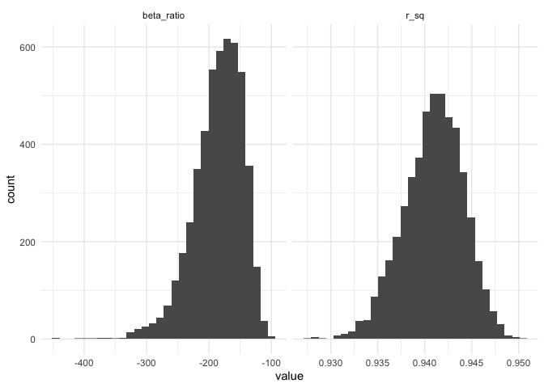
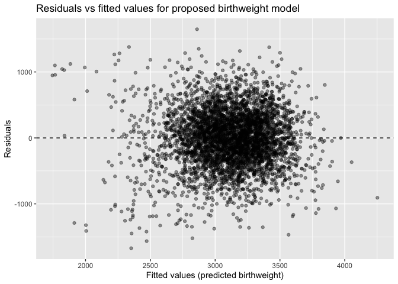

hw6_vy2196
================

``` r
library(tidyverse)
```

    ## ── Attaching core tidyverse packages ──────────────────────── tidyverse 2.0.0 ──
    ## ✔ dplyr     1.1.4     ✔ readr     2.1.5
    ## ✔ forcats   1.0.1     ✔ stringr   1.5.1
    ## ✔ ggplot2   4.0.0     ✔ tibble    3.3.0
    ## ✔ lubridate 1.9.4     ✔ tidyr     1.3.1
    ## ✔ purrr     1.1.0     
    ## ── Conflicts ────────────────────────────────────────── tidyverse_conflicts() ──
    ## ✖ dplyr::filter() masks stats::filter()
    ## ✖ dplyr::lag()    masks stats::lag()
    ## ℹ Use the conflicted package (<http://conflicted.r-lib.org/>) to force all conflicts to become errors

``` r
library(broom)
library(purrr)
library(forcats)
```

### Problem 1

``` r
homicides = read.csv("homicide_data.csv") |>
  janitor::clean_names() |>
  mutate(
    city_state = str_c(city, ", ", state),
    solved = if_else(disposition == "Closed by arrest", 1, 0),
    victim_age = as.numeric(victim_age)) |>
  # drop specific cities
  filter(
    !city_state %in% c("Dallas, TX", "Phoenix, AZ", 
                       "Kansas City, MO", "Tulsa, AL"),
    victim_race %in% c("White", "Black"))
```

    ## Warning: There was 1 warning in `mutate()`.
    ## ℹ In argument: `victim_age = as.numeric(victim_age)`.
    ## Caused by warning:
    ## ! NAs introduced by coercion

``` r
baltimore_dat = homicides |>
  filter(city_state == "Baltimore, MD")

fit_baltimore = glm(
  solved ~ victim_age + victim_sex + victim_race,
  data = baltimore_dat,
  family = binomial())

# adjusted OR and CI for male vs female (Baltimore)
baltimore_OR = tidy(
  fit_baltimore,
  exponentiate = TRUE,
  conf.int = TRUE) |>
  filter(term == "victim_sexMale") |>
  select(term, estimate, conf.low, conf.high)

baltimore_OR
```

    ## # A tibble: 1 × 4
    ##   term           estimate conf.low conf.high
    ##   <chr>             <dbl>    <dbl>     <dbl>
    ## 1 victim_sexMale    0.426    0.324     0.558

In Baltimore, MD, the adjusted odds ratio for homicide resolution for
male victims compared with female victims is 0.43 (95% CI: 0.32–0.56),
indicating that, holding age and race constant, homicides involving male
victims have substantially lower odds of being solved. The confidence
interval excludes 1, suggesting this association is statistically
significant.

``` r
# Fit glm for each city
city_models = homicides |>
  group_by(city_state) |>
  nest() |>
  mutate(
    model = map(data,
      ~ glm(
        solved ~ victim_age + victim_sex + victim_race,
        data = .x,
        family = binomial())),
    tidied = map(
      model,
      ~ tidy(.x, exponentiate = TRUE, conf.int = TRUE))) |>
  select(city_state, tidied) |>
  unnest(tidied) |>
  filter(term == "victim_sexMale") |>
  ungroup() |>
  mutate(
    city_state = fct_reorder(city_state, estimate))
```

    ## Warning: There were 43 warnings in `mutate()`.
    ## The first warning was:
    ## ℹ In argument: `tidied = map(model, ~tidy(.x, exponentiate = TRUE, conf.int =
    ##   TRUE))`.
    ## ℹ In group 1: `city_state = "Albuquerque, NM"`.
    ## Caused by warning:
    ## ! glm.fit: fitted probabilities numerically 0 or 1 occurred
    ## ℹ Run `dplyr::last_dplyr_warnings()` to see the 42 remaining warnings.

``` r
# check the first few rows of ORs and CIs by city
city_models |> select(city_state, estimate, conf.low, conf.high) |> head()
```

    ## # A tibble: 6 × 4
    ##   city_state      estimate conf.low conf.high
    ##   <fct>              <dbl>    <dbl>     <dbl>
    ## 1 Albuquerque, NM    1.77     0.825     3.76 
    ## 2 Atlanta, GA        1.00     0.680     1.46 
    ## 3 Baltimore, MD      0.426    0.324     0.558
    ## 4 Baton Rouge, LA    0.381    0.204     0.684
    ## 5 Birmingham, AL     0.870    0.571     1.31 
    ## 6 Boston, MA         0.674    0.353     1.28

``` r
# Plot ORs and CIs by city


ggplot(city_models, aes(x = city_state, y = estimate)) +
  geom_hline(yintercept = 1, linetype = "dashed") +
  geom_errorbar(aes(ymin = conf.low, ymax = conf.high), width = 0.9) +
  geom_point(size = 2) +
  coord_flip() +
  labs(
    x = "City",
    y = "Adjusted Odds Ratio (Male vs Female)",
    title = "Adjusted Odds Ratios for Solving Homicides by City",
    subtitle = "Male vs Female victims, adjusted for age and race"
  )
```

<!-- --> Each
point represents the adjusted odds ratio comparing the likelihood of
solving homicides involving male victims to those involving female
victims, while age and race remain constant. The horizontal bars
represent 95% confidence intervals, and cities are ordered by their
estimated ORs for easier comparison. An OR above 1 indicates higher odds
of solving homicides of male victims, while an OR below 1 indicates
lower odds.

### Problem 2

``` r
library(p8105.datasets)
library(modelr)
```

    ## 
    ## Attaching package: 'modelr'

    ## The following object is masked from 'package:broom':
    ## 
    ##     bootstrap

``` r
data("weather_df")

weather_clean =
  weather_df |>
  select(tmax, tmin, prcp) |>
  drop_na()

set.seed(123)   


boot_results =
  weather_clean |>
  modelr::bootstrap(n = 5000) |>                 
  mutate(
    # fit the regression in each resample
    model  = map(strap, ~ lm(tmax ~ tmin + prcp, data = .x)),
    
    # glance: contains r.squared
    model_glance = map(model, glance),
    
    # tidy: contains coefficient estimates
    model_tidy   = map(model, tidy),
    
    # pull out R^2
    r_sq = map_dbl(model_glance, "r.squared"),
    
    # pull out the slopes for tmin (β1) and prcp (β2) and form the ratio β1/β2
    beta_ratio = map_dbl(
      model_tidy,
      ~ {
        b1 = .x |> filter(term == "tmin") |> pull(estimate)
        b2 = .x |> filter(term == "prcp") |> pull(estimate)
        b1 / b2
      }))
```

``` r
boot_results |>
  select(r_sq, beta_ratio) |>
  pivot_longer(everything(),
               names_to = "quantity",
               values_to = "value") |>
  ggplot(aes(x = value)) +
  geom_histogram(bins = 30) +
  facet_wrap(~ quantity, scales = "free_x") +
  theme_minimal()
```

<!-- --> The
bootstrap distribution of r-square is tightly concentrated around ~0.942
with very little variability, indicating that the linear model
consistently explains a large portion of the variability in tmax. This
suggests high stability and strong predictive usefulness of tmin and
prcp.

The bootstrap distribution of the ratio beta1/beta2 is wide and left
skewed, ranging approximately from –400 to –100. This reflects
substantial uncertainty in comparing the effect of minimum temperature
to precipitation on maximum temperature. Because the precipitation
coefficient is small and unstable across samples, the ratio is highly
variable.

``` r
#CI
ci_results =
  boot_results |>
  summarise(
    r2_lower   = quantile(r_sq, 0.025),
    r2_upper   = quantile(r_sq, 0.975),
    ratio_lower = quantile(beta_ratio, 0.025),
    ratio_upper = quantile(beta_ratio, 0.975)
  )

ci_results
```

    ## # A tibble: 1 × 4
    ##   r2_lower r2_upper ratio_lower ratio_upper
    ##      <dbl>    <dbl>       <dbl>       <dbl>
    ## 1    0.934    0.947       -277.       -126.

The linear regression model predicting tmax from tmin and prcp is highly
stable: the 95% bootstrap confidence interval for r-sqaure is (0.934,
0.947), indicating that the model consistently explains more than 93% of
the variability in maximum temperature. In contrast, the distribution of
the ratio of coefficient estimates beta1/beta2 is wide, with a 95% CI of
(–277, –126). This large spread reflects high uncertainty in the
relative effect sizes, driven primarily by the small and noisy
precipitation coefficient, which makes the ratio unstable across
bootstrap samples.

### Problem 3

``` r
birthweight = read.csv("birthweight.csv") 

bw = birthweight |>
    mutate(
    # regression model treats them as categorical rather than numeric
    babysex = factor(babysex, labels = c("male", "female")),
    frace   = factor(frace),
    mrace   = factor(mrace),
    malform = factor(malform),)

sum(is.na(birthweight))
```

    ## [1] 0

``` r
# fit the model
mod_my = lm(
  bwt ~ gaweeks + ppbmi + wtgain + smoken + momage + parity + mrace + babysex,
  data = bw)

summary(mod_my)
```

    ## 
    ## Call:
    ## lm(formula = bwt ~ gaweeks + ppbmi + wtgain + smoken + momage + 
    ##     parity + mrace + babysex, data = bw)
    ## 
    ## Residuals:
    ##      Min       1Q   Median       3Q      Max 
    ## -1672.03  -262.12     4.83   273.97  1647.73 
    ## 
    ## Coefficients:
    ##                Estimate Std. Error t value Pr(>|t|)    
    ## (Intercept)    507.8535    98.9021   5.135 2.95e-07 ***
    ## gaweeks         54.1654     2.1329  25.395  < 2e-16 ***
    ## ppbmi           19.7164     2.0788   9.484  < 2e-16 ***
    ## wtgain           9.8552     0.6074  16.226  < 2e-16 ***
    ## smoken         -11.5394     0.9065 -12.729  < 2e-16 ***
    ## momage           2.7643     1.8271   1.513   0.1304    
    ## parity          95.9551    63.4038   1.513   0.1303    
    ## mrace2        -290.0281    14.9974 -19.339  < 2e-16 ***
    ## mrace3        -137.8941    66.6509  -2.069   0.0386 *  
    ## mrace4        -181.4399    29.3490  -6.182 6.91e-10 ***
    ## babysexfemale  -85.0421    13.0154  -6.534 7.15e-11 ***
    ## ---
    ## Signif. codes:  0 '***' 0.001 '**' 0.01 '*' 0.05 '.' 0.1 ' ' 1
    ## 
    ## Residual standard error: 427.3 on 4331 degrees of freedom
    ## Multiple R-squared:  0.3056, Adjusted R-squared:  0.304 
    ## F-statistic: 190.6 on 10 and 4331 DF,  p-value: < 2.2e-16

``` r
tidy(mod_my)
```

    ## # A tibble: 11 × 5
    ##    term          estimate std.error statistic   p.value
    ##    <chr>            <dbl>     <dbl>     <dbl>     <dbl>
    ##  1 (Intercept)     508.      98.9        5.13 2.95e-  7
    ##  2 gaweeks          54.2      2.13      25.4  9.52e-133
    ##  3 ppbmi            19.7      2.08       9.48 3.90e- 21
    ##  4 wtgain            9.86     0.607     16.2  1.59e- 57
    ##  5 smoken          -11.5      0.907    -12.7  1.82e- 36
    ##  6 momage            2.76     1.83       1.51 1.30e-  1
    ##  7 parity           96.0     63.4        1.51 1.30e-  1
    ##  8 mrace2         -290.      15.0      -19.3  5.49e- 80
    ##  9 mrace3         -138.      66.7       -2.07 3.86e-  2
    ## 10 mrace4         -181.      29.3       -6.18 6.91e- 10
    ## 11 babysexfemale   -85.0     13.0       -6.53 7.15e- 11

I included all possible values that focus on maternal characteristics
and gestational age. Then `lm` fits a linear regression with birth
weight as outcome. Then `summary` and `tidy` give estimates, standard
errors, p-values, etc.

``` r
# Residuals vs fitted plot

bw_my = bw |>
  add_predictions(mod_my) |>
  add_residuals(mod_my)

ggplot(bw_my, aes(x = pred, y = resid)) +
  geom_point(alpha = 0.4) +
  geom_hline(yintercept = 0, linetype = "dashed") +
  labs(
    x = "Fitted values (predicted birthweight)",
    y = "Residuals",
    title = "Residuals vs fitted values for proposed birthweight model"
  )
```

<!-- -->

The residuals vs fitted plot shows that the residuals are centered
around zero with no strong pattern, indicating that the linearity
assumption is reasonably met. There is no obvious funnel shape,
suggesting that heteroskedasticity is limited, although the residual
spread does increase slightly at higher fitted values. Overall, this
diagnostic plot indicates that the proposed model fits the data
adequately, with no major violations of regression assumptions.

``` r
# length at birth and gestational age as predictors (main effects only)
mod_simple = function(df) {
  lm(bwt ~ blength + gaweeks, data = df)}

# head circumference, length, sex, and all interactions 
mod_interact = function(df) {
  lm(bwt ~ bhead * blength * babysex, data = df)}

# my proposed model into a function
mod_my_fun = function(df) {
  lm(
    bwt ~ gaweeks + ppbmi + wtgain + smoken +
      momage + parity + mrace + babysex,
    data = df
  )}
```

``` r
# cross validation

set.seed(1)

cv_df = crossv_mc(
  bw,
  n    = 100,   # number of random splits
  test = 0.2    # proportion in training set
)


cv_results = cv_df |>
  mutate(
    # fit models on the training data
    mod_my       = map(train, mod_my_fun),
    mod_simple   = map(train, mod_simple),
    mod_interact = map(train, mod_interact),

    # compute RMSE on the corresponding test data
    rmse_my       = map2_dbl(mod_my,       test, ~ rmse(.x, .y)),
    rmse_simple   = map2_dbl(mod_simple,   test, ~ rmse(.x, .y)),
    rmse_interact = map2_dbl(mod_interact, test, ~ rmse(.x, .y))
  )
```

    ## Warning: There was 1 warning in `mutate()`.
    ## ℹ In argument: `rmse_my = map2_dbl(mod_my, test, ~rmse(.x, .y))`.
    ## Caused by warning in `predict.lm()`:
    ## ! prediction from rank-deficient fit; attr(*, "non-estim") has doubtful cases

``` r
rmse_summary <- cv_results |>
  select(starts_with("rmse_")) |>
  pivot_longer(everything(),
               names_to = "model",
               values_to = "rmse") |>
  group_by(model) |>
  summarise(
    mean_rmse = mean(rmse),
    sd_rmse   = sd(rmse),
    .groups   = "drop"
  )

rmse_summary
```

    ## # A tibble: 3 × 3
    ##   model         mean_rmse sd_rmse
    ##   <chr>             <dbl>   <dbl>
    ## 1 rmse_interact      289.    9.22
    ## 2 rmse_my            429.    9.81
    ## 3 rmse_simple        332.   14.0

Based on the mean RMSE of the three predicitve models, we can conclude
that the interaction model is the best predictive model due to its low
RMSE. Followed by the simple model, which has ~332 RMSE. The proposed
model has the poorest performance due to its high RMSE.
